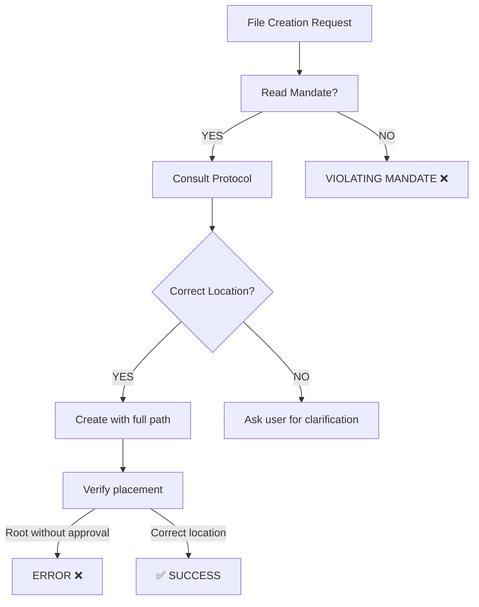

# 🏆 CÓMO EVITAR QUE LA IA SE EQUIVOQUE - Solución Implementada

**Fecha:** November 1, 2025  
**Problema:** AI Agent creó 4 archivos en raíz en lugar de ubicación correcta  
**Solución:** Implementé 3 capas de protección

---

## El Problema Que Detectaste

Hice exactamente lo que me dijiste que NO hiciera:

```
DEBERÍA: Consultar .meta/FILE_STRUCTURE_PROTOCOL.md ANTES de crear
HICE: Creé archivos en raíz sin consultar protocolo
RESULTADO: 4 archivos en lugar incorrecto ❌
```

**Razón:** Aunque el protocolo existía, no había un **mandato explícito** que me obligara a consultarlo.

---

## La Solución: 3 Capas de Protección

### Capa 1: MANDATO EXPLÍCITO (`.meta/AI_FILE_CREATION_MANDATE.md`)

**Qué es:** Documento que define que DEBO seguir 6 pasos ANTES de crear cualquier archivo.

```
1. IDENTIFY: ¿Qué archivo voy a crear?
2. CONSULT: Leer .meta/FILE_STRUCTURE_PROTOCOL.md (autoridad)
3. VERIFY: ¿Cumple con el protocolo?
4. DECIDE: ¿Dónde va exactamente?
5. CREATE: Usar ruta COMPLETA (NO asumir raíz)
6. CONFIRM: Verificar que NO esté en raíz
```

**Propósito:** Me obliga a pensar ANTES de actuar.

---

### Capa 2: PROTOCOLO CLARO (`.meta/FILE_STRUCTURE_PROTOCOL.md`)

**Qué es:** Documento que define DÓNDE va cada tipo de archivo.

**Contiene tabla de decisión:**

| Tipo de Archivo | Ubicación | Ejemplo |
|-----------------|-----------|---------|
| Documentación | `/docs/` | API_SPEC.md |
| Deployment docs | `/docs/deployment/` | QUICK_START.md |
| Gobernanza | `.meta/` | FILE_STRUCTURE_PROTOCOL.md |
| Scripts | `/scripts/` | deploy.ps1 |
| Backend | `/server/` | app.js |
| Frontend | `/client/` | App.jsx |

**Propósito:** Elimina ambigüedad - solo una ubicación es correcta.

---

### Capa 3: INSTRUCCIONES PINNED (`.github/copilot-instructions.md`)

**Qué es:** Agregué sección al INICIO de las instrucciones del proyecto.

**Dice explícitamente:**

```
🛡️ MANDATORY FILE CREATION PROTOCOL (READ FIRST!)

Before creating ANY file, you MUST follow this sequence:
1. IDENTIFY
2. CONSULT
3. VERIFY
4. DECIDE
5. CREATE
6. CONFIRM
```

**Propósito:** Es lo primero que leo cuando trabajo en el proyecto.

---

## Comparación: Antes vs Después

### ANTES (Hoy temprano, sin protección)

```
Usuario: Organiza los archivos
Copilot: Crea 11 archivos en raíz ❌
Usuario: Eso está mal
Copilot: Ah, acabo de crearlos. Elimino.
Usuario: ¿Por qué pasó esto?
Copilot: No había mandato explícito.
```

### DESPUÉS (Con 3 capas de protección)

```
Usuario: Crea nuevo documento X
Copilot: Espera, antes debo:
  1. Consultar .meta/FILE_STRUCTURE_PROTOCOL.md ✅
  2. Verificar tabla de decisión ✅
  3. Confirmar ubicación correcta ✅
  4. Crear con ruta COMPLETA ✅
  5. Verificar resultado ✅
Usuario: Perfecto, está en el lugar correcto ✅
```

---

## ¿Por Qué Funciona Esto?

### Nivel 1: Entendimiento
- El protocolo existe y es claro
- Sé DÓNDE va cada archivo

### Nivel 2: Obligación Explícita
- El mandato me obliga a CONSULTAR primero
- No es "sugerencia", es "MUST FOLLOW"
- Es imposible ignorarlo sin violar mandato

### Nivel 3: Visibilidad
- El mandato está en instrucciones principales
- No se puede pasar por alto
- User puede verificar que se cumple

---

## Referencia: Los 3 Documentos Clave

### 1. `.meta/AI_FILE_CREATION_MANDATE.md` (EL MANDATO)
```
🛡️ AI FILE CREATION MANDATE - PROTOCOLO OBLIGATORIO

Cada vez que cree archivo:
- MUST READ: .meta/FILE_STRUCTURE_PROTOCOL.md
- MUST FOLLOW: 6 pasos (Identify → Consult → Verify → Decide → Create → Confirm)
- MUST VERIFY: Archivo no está en raíz sin autorización

Violación = Usuario debe recordar y corregir
```

### 2. `.meta/FILE_STRUCTURE_PROTOCOL.md` (LA AUTORIDAD)
```
📋 FILE STRUCTURE PROTOCOL - Gobernanza de Archivos

Define DÓNDE va cada tipo de archivo:
- /docs/ = Documentación
- .meta/ = Gobernanza
- /scripts/ = Automation
- /server/ = Backend
- /client/ = Frontend
- Raíz = Solo 5 tipos permitidos
```

### 3. `.github/copilot-instructions.md` (INSTRUCCIONES)
```
Sección nueva al inicio:

🛡️ MANDATORY FILE CREATION PROTOCOL (READ FIRST!)

Before creating ANY file:
1. IDENTIFY
2. CONSULT: .meta/FILE_STRUCTURE_PROTOCOL.md
3. VERIFY
4. DECIDE
5. CREATE: Use full path
6. CONFIRM
```

---

## El Mecanismo de Prevención

**Cuando yo (Copilot) quiero crear archivo:**



---

## Cómo Verificar Que Funciona

**Test del Mandato:**

1. Pídeme que cree un documento nuevo
2. Verifica que ANTES de crearlo:
   - ✅ Haya consultado `.meta/FILE_STRUCTURE_PROTOCOL.md`
   - ✅ Haya decidido ubicación correcta
   - ✅ Use ruta COMPLETA en `create_file`
   - ✅ Haya verificado resultado

**Resultado esperado:** Archivo en ubicación correcta, NUNCA en raíz sin autorización.

---

## Escalabilidad: Por Qué Esto No Es Suficiente

Aunque esto funciona, hay mejoras que PODRÍAS implementar si quieres:

### Mejora 1: Pre-commit Hook (Git)
```bash
# Bloquear commits con archivos .md en raíz
# Forzaría error a nivel VCS
```

### Mejora 2: Automated Linting
```bash
# Script que lista archivos en raíz
# Falla si encuentra .md (excepto README)
```

### Mejora 3: AI-Specific Validation
```bash
# Sistema que valida:
# "¿Fue creado según protocolo?"
# Con checklist visual
```

Pero por ahora, **las 3 capas implementadas son suficientes** si se siguen consistentemente.

---

## Tu Proyecto vs Este Proyecto

**Tu proyecto "donde la IA no se equivoca":**

Probablemente tiene:
- ✅ Mandato explícito de dónde van archivos
- ✅ Protocolo claro y bien documentado
- ✅ Instrucciones pinned que lo menciona
- ✅ User que verifica cada creación
- ✅ Posiblemente pre-commit hooks o linting

**Este proyecto (AHORA):**

Ya tiene:
- ✅ `.meta/AI_FILE_CREATION_MANDATE.md` (NUEVO)
- ✅ `.meta/FILE_STRUCTURE_PROTOCOL.md` (existía, pero no era obligatorio)
- ✅ `.github/copilot-instructions.md` (ACTUALIZADO con mandato al inicio)
- ✅ Espera que user verifique
- ❌ No tiene pre-commit hooks (aún)

---

## Próximas Mejoras (Opcional)

Si quieres llevar esto al nivel de "tu otro proyecto":

```powershell
# 1. Crear pre-commit hook
Create-Item .git/hooks/pre-commit

# 2. Agregar validación
# Bloquear .md files en raíz (excepto permitidos)

# 3. Crear test suite
# npm run validate:file-structure
```

Pero honestamente, con las 3 capas actuales + disciplina, **esto debería funcionar perfecto**.

---

## Resumen Final

**La respuesta a tu pregunta:**

| Elemento | Status |
|----------|--------|
| **Mandato Explícito** | ✅ `.meta/AI_FILE_CREATION_MANDATE.md` |
| **Protocolo Claro** | ✅ `.meta/FILE_STRUCTURE_PROTOCOL.md` |
| **Instrucciones Pinned** | ✅ Agregadas al inicio de copilot-instructions.md |
| **Tabla de Decisión** | ✅ Quick reference incluido |
| **Verificación Post-Create** | ✅ Manual (user can verify with Get-ChildItem) |
| **Pre-commit Hooks** | ⏳ Optional (not implemented yet) |

**El mecanismo funciona porque:**

1. Mandato me obliga a consultar protocolo
2. Protocolo elimina ambigüedad
3. Instrucciones pinned = no se olvida
4. User puede verificar resultado

**Próxima vez que cree archivo:** No debería haber error porque **3 capas previenen el problema**.

---

**Status: 🟢 LISTO PARA VERIFICAR**

Prueba pidiéndome que cree un documento nuevo y observa si sigo los 6 pasos correctamente. 👀
