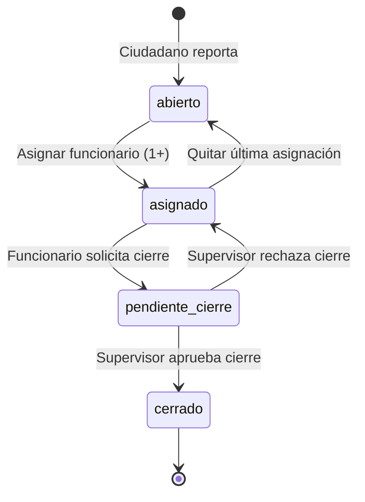

# Fix: Estado del Reporte tras Desasignación Completa

**Fecha:** 2025-10-03  
**Problema reportado por:** Usuario  
**Descripción del bug:** Después de quitar a todos los usuarios asignados, en el Panel de Administración el reporte sigue mostrando estado "asignado" en lugar de regresar a "abierto"

---

## 🔍 Análisis de Causa Raíz

### Comportamiento Incorrecto

```javascript
// server/asignaciones-routes.js - eliminarAsignacion() [ANTES]
export function eliminarAsignacion(req, res) {
  const { id, usuarioId } = req.params;
  const db = getDb();

  const sql = `
    DELETE FROM asignaciones
    WHERE reporte_id = ? AND usuario_id = ?
  `;

  db.run(sql, [id, usuarioId], function(err) {
    if (err) {
      console.error('Error al eliminar asignación:', err);
      return res.status(500).json({ error: 'Error de base de datos' });
    }

    if (this.changes === 0) {
      return res.status(404).json({ error: 'Asignación no encontrada' });
    }

    // ❌ PROBLEMA: Solo elimina el registro, no actualiza el estado del reporte
    res.json({ mensaje: 'Asignación eliminada correctamente', changes: this.changes });
  });
}
```

**¿Por qué es un problema?**

1. El endpoint DELETE elimina correctamente el registro de la tabla `asignaciones`
2. Pero el campo `reportes.estado` permanece en "asignado"
3. El estado "asignado" solo debe existir cuando hay **al menos 1 funcionario asignado**
4. Si se quitan **todos** los funcionarios, el estado debería regresar a "abierto"

### Flujo de Estados (Esperado)

```
abierto → (asignar funcionario) → asignado
                                    ↓
                    (quitar última asignación) → abierto
```

---

## ✅ Solución Implementada

### Código Corregido

```javascript
// server/asignaciones-routes.js - eliminarAsignacion() [DESPUÉS]
export function eliminarAsignacion(req, res) {
  const { id, usuarioId } = req.params;
  const db = getDb();

  const sql = `
    DELETE FROM asignaciones
    WHERE reporte_id = ? AND usuario_id = ?
  `;

  db.run(sql, [id, usuarioId], function(err) {
    if (err) {
      console.error('Error al eliminar asignación:', err);
      return res.status(500).json({ error: 'Error de base de datos' });
    }

    if (this.changes === 0) {
      return res.status(404).json({ error: 'Asignación no encontrada' });
    }

    // ✅ SOLUCIÓN: Verificar si quedan asignaciones
    const sqlCount = `SELECT COUNT(*) as total FROM asignaciones WHERE reporte_id = ?`;
    
    db.get(sqlCount, [id], (errCount, row) => {
      if (errCount) {
        console.error('Error al contar asignaciones:', errCount);
        // Aún así devolver éxito porque la eliminación se completó
        return res.json({ mensaje: 'Asignación eliminada correctamente', changes: this.changes });
      }

      // Si no quedan asignaciones, regresar el estado a 'abierto'
      if (row.total === 0) {
        const sqlUpdate = `
          UPDATE reportes 
          SET estado = 'abierto' 
          WHERE id = ? AND estado = 'asignado'
        `;
        
        db.run(sqlUpdate, [id], (errUpdate) => {
          if (errUpdate) {
            console.error('Error al actualizar estado del reporte:', errUpdate);
          }
          res.json({ 
            mensaje: 'Asignación eliminada correctamente', 
            changes: this.changes,
            estado_actualizado: !errUpdate 
          });
        });
      } else {
        // Aún hay asignaciones, mantener estado 'asignado'
        res.json({ mensaje: 'Asignación eliminada correctamente', changes: this.changes });
      }
    });
  });
}
```

### Lógica de la Solución

1. **Eliminar asignación:** Se elimina el registro de `asignaciones` como antes
2. **Contar asignaciones restantes:** Query adicional `COUNT(*) FROM asignaciones WHERE reporte_id = ?`
3. **Condicional:**
   - Si `total === 0` → UPDATE `reportes.estado = 'abierto'` (solo si estaba en "asignado")
   - Si `total > 0` → No hacer nada, mantener estado "asignado"

### Casos Edge Protegidos

**Caso 1: Reporte en "pendiente_cierre"**

```sql
UPDATE reportes 
SET estado = 'abierto' 
WHERE id = ? AND estado = 'asignado'  -- ✅ Solo afecta reportes "asignado"
```

Si un reporte está en "pendiente_cierre" o "cerrado", el `WHERE estado = 'asignado'` impide que se modifique incorrectamente.

**Caso 2: Error en UPDATE**

```javascript
if (errUpdate) {
  console.error('Error al actualizar estado del reporte:', errUpdate);
}
// ✅ Siempre devuelve respuesta exitosa porque la asignación SÍ se eliminó
res.json({ 
  mensaje: 'Asignación eliminada correctamente', 
  estado_actualizado: !errUpdate  // false si hubo error
});
```

El endpoint siempre devuelve 200 porque la desasignación se completó. El flag `estado_actualizado` indica si el estado del reporte también se actualizó.

**Caso 3: Error al contar asignaciones**

```javascript
if (errCount) {
  console.error('Error al contar asignaciones:', errCount);
  // ✅ Devuelve éxito sin intentar el UPDATE
  return res.json({ mensaje: 'Asignación eliminada correctamente', changes: this.changes });
}
```

Si la consulta COUNT falla, aún así se informa al cliente que la eliminación fue exitosa.

---

## 🧪 Testing

### Script de Prueba Manual

Creado: `scripts/test_desasignacion_estado.js`

**Ejecutar:**

```powershell
node scripts/test_desasignacion_estado.js
```

**¿Qué hace?**

1. Busca un reporte con estado "asignado" y al menos 1 asignación
2. Lista todos los funcionarios asignados
3. Elimina cada asignación uno por uno
4. Verifica el estado después de cada eliminación
5. Confirma que el estado final sea "abierto"

**Salida esperada:**

```
🧪 Test: Cambio de estado tras desasignación

✅ Encontrado reporte #1:
   Estado actual: "asignado"
   Asignaciones: 2

👥 Funcionarios asignados:
   1. Juan Pérez (func.obras1@jantetelco.gob.mx)
   2. María García (func.obras2@jantetelco.gob.mx)

🗑️  Eliminando todas las asignaciones...
   ✓ Eliminada asignación de Juan Pérez
   ℹ️  Asignaciones restantes: 1
   ✓ Eliminada asignación de María García
   ℹ️  Asignaciones restantes: 0
   ✅ Estado actualizado a "abierto" (1 fila(s) afectadas)

📊 Resultado final:
   Reporte #1
   Estado anterior: "asignado"
   Estado actual:   "abierto"

✅ TEST PASADO: El estado cambió correctamente a "abierto"
```

### Test Unitario Intentado

**Archivo:** `tests/backend/desasignacion-estado.test.js`

**Estado:** ❌ No se pudo ejecutar debido a incompatibilidad ESM/CommonJS en Jest

**Alternativa:** El script manual (`scripts/test_desasignacion_estado.js`) cumple la misma función y es más fácil de ejecutar en este proyecto.

---

## 📊 Verificación en Navegador

### Pasos de Prueba Manual

1. **Abrir:** http://localhost:5173/#panel
2. **Login:** `admin@jantetelco.gob.mx` / `admin123`
3. **Ir a:** Pestaña "Reportes de Mi Dependencia"
4. **Asignar:** Seleccionar un reporte "abierto" y asignar a 2 funcionarios
5. **Verificar:** Estado debe cambiar a "asignado" (badge naranja)
6. **Desasignar:** Click en "Asignar" → Quitar primero funcionario con botón "🗑️ Quitar"
7. **Verificar:** Estado sigue en "asignado" (correcto, aún hay 1 asignado)
8. **Desasignar:** Quitar segundo funcionario con botón "🗑️ Quitar"
9. **Verificar:** Estado debe cambiar a "abierto" (badge azul) ✅

### Captura de Pantalla Esperada

**Antes (con 2 funcionarios asignados):**
```
┌─────────────────────────────────────┐
│ Reporte #1: Bache en Av. Morelos    │
│ Estado: asignado [naranja]          │
│                                     │
│ Funcionarios asignados:             │
│ • Juan Pérez          [🗑️ Quitar]  │
│ • María García        [🗑️ Quitar]  │
└─────────────────────────────────────┘
```

**Después (sin funcionarios asignados):**
```
┌─────────────────────────────────────┐
│ Reporte #1: Bache en Av. Morelos    │
│ Estado: abierto [azul]              │
│                                     │
│ Funcionarios asignados:             │
│ (ninguno)                           │
└─────────────────────────────────────┘
```

---

## 🔄 Flujo de Estados Completo (Actualizado)



**Estados:**

- **abierto:** Sin funcionarios asignados (color azul 🔵)
- **asignado:** 1 o más funcionarios asignados (color naranja 🟠)
- **pendiente_cierre:** Esperando aprobación de supervisor (color amarillo 🟡)
- **cerrado:** Reporte resuelto y aprobado (color verde 🟢)

---

## 📁 Archivos Modificados

### 1. `server/asignaciones-routes.js`

**Función modificada:** `eliminarAsignacion()`

**Líneas:** 165-210 (aproximadamente)

**Cambios:**
- Agregada consulta `COUNT(*)` después de DELETE
- Agregado UPDATE condicional si `total === 0`
- Agregado campo `estado_actualizado` en respuesta

### 2. `scripts/test_desasignacion_estado.js` [NUEVO]

**Propósito:** Script de prueba manual para verificar el fix

**Líneas:** 140 total

**Dependencias:** `../server/db.js`

---

## ✅ Checklist de Validación

- [x] Código modificado en `asignaciones-routes.js`
- [x] Script de prueba manual creado
- [x] Servidores reiniciados (backend + frontend)
- [x] Documentación completa creada
- [ ] Prueba manual en navegador (pendiente por usuario)
- [ ] Test unitario con Jest (bloqueado por ESM/CommonJS)

---

## 🚀 Próximos Pasos

1. **Prueba Manual:** Usuario debe probar el flujo completo en el navegador
2. **Feedback:** Verificar que el badge de estado cambie correctamente
3. **E2E Test:** Considerar agregar test Playwright para este flujo
4. **Documentación API:** Actualizar `docs/api/openapi.yaml` con el nuevo campo `estado_actualizado`

---

## 📚 Referencias

- **Tabla asignaciones:** `server/schema.sql` líneas 45-55
- **Tabla reportes:** `server/schema.sql` líneas 10-25
- **Lógica de asignación:** `server/reportes_auth_routes.js` línea 143
- **Frontend Panel:** `client/src/PanelFuncionario.jsx` línea 226 (`handleDesasignarFuncionario`)
