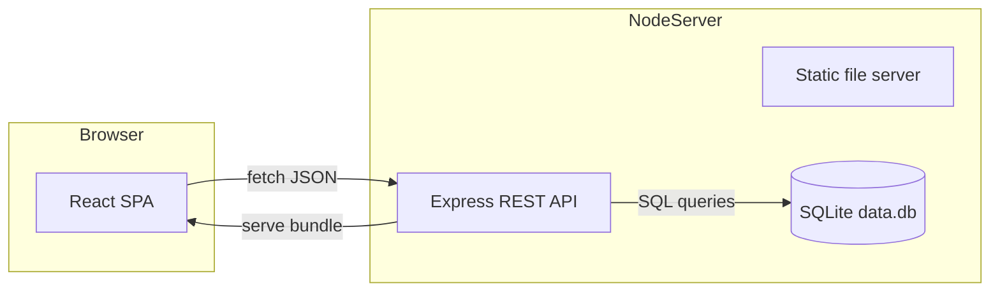

# Arquitectura

## Resumen ejecutivo
La plataforma citizen-reports Heatmap está compuesta por dos capas principales dentro del mismo monorrepo:

- **Cliente SPA (React + Vite):** Proporciona el mapa de calor, captura de reportes y exportaciones.
- **API/Servidor (Express + SQLite):** Expone servicios REST, persiste los reportes y sirve los assets compilados del cliente.

Ambos componentes pueden ejecutarse de forma independiente en desarrollo, pero en producción se despliegan como **un único proceso Node.js** que levanta la API y sirve la carpeta `client/dist`.

## Componentes principales

| Componente | Responsabilidades clave | Artefactos |
|------------|------------------------|------------|
| **React SPA** | Renderizado del mapa con Leaflet, gestión de capas, formularios para crear reportes, filtros avanzados, exportación a PNG/GeoJSON | `client/src/` |
| **API Express** | CRUD de reportes, validación de datos, agregaciones por grid, exportación GeoJSON, middleware de seguridad, logging | `server/server.js`, `server/db.js` |
| **SQLite** | Persistencia transaccional y consultas geográficas simples mediante índices | `server/schema.sql`, archivo `data.db` |
| **Tooling IA** | Guardrails para agentes autónomos (Copilot/Claude) y scripts de edición segura | `ai/`, `code_surgeon/` |

## Diagrama de despliegue lógico

## Flujo de datos

1. El usuario reporta un evento con latitud/longitud.
1. El cliente llama `POST /api/reportes` con `tipo`, `descripcion`, `lat`, `lng`, `peso`.
1. El servidor valida coordenadas y normaliza el peso, luego inserta en `reportes` dentro de SQLite.
1. Las vistas consultan `GET /api/reportes` o `GET /api/reportes/grid` dependiendo del modo seleccionado:

  - **Heatmap directo:** devuelve puntos individuales con intensidad.
  - **Agregación por celdas:** agrupa por cuadrículas de tamaño configurable para mayor privacidad.

1. Las exportaciones (`/geojson`) generan un `FeatureCollection` compatible con GIS.

## Consideraciones de diseño

- **Escalabilidad horizontal:** La base SQLite está pensada para despliegues monolíticos o edge (e.g. Fly.io, Railway). Para escenarios de alta concurrencia se recomienda migrar a Postgres y ajustar la capa de acceso (repositorio). El API ya encapsula la lógica de consultas de forma que el cambio sea acotado.
- **Seguridad:** Se incluyen Helmet, CORS, compresión y validaciones estrictas de coordenadas. Para entornos expuestos se sugiere añadir rate limiting y autenticación (ver hoja de ruta en `README.md`).
- **Observabilidad:** Morgan provee logging HTTP; agregar APM (p. ej. OpenTelemetry) resulta trivial gracias a la estructura modular.

## Integraciones clave

- **Leaflet + leaflet.heat:** Renderiza múltiples capas de calor y soporta gradientes personalizados.
- **html-to-image:** Genera capturas PNG de la vista actual del mapa para reportes ejecutivos.
- **Playwright:** Automatiza pruebas E2E para asegurar que la SPA se renderiza incluso tras cambios en back o front.

## Extensibilidad

- Nuevos endpoints pueden añadirse en `server/server.js`; reutiliza `getDb()` para manejar conexiones atómicas.
- El frontend está organizado por componentes funcionales simples; nuevas vistas pueden montarse en `App.jsx` siguiendo el estilo de `MapView.jsx`.
- Las pruebas están preconfiguradas (Jest/Vitest/Playwright) para mantener una disciplina TDD.

## Referencias cruzadas

- **Especificación API detallada:** `docs/api/openapi.yaml`
- **Lineamientos de privacidad:** `docs/security_privacy.md`
- **Decisiones arquitectónicas (ADR):** `docs/adr/`
